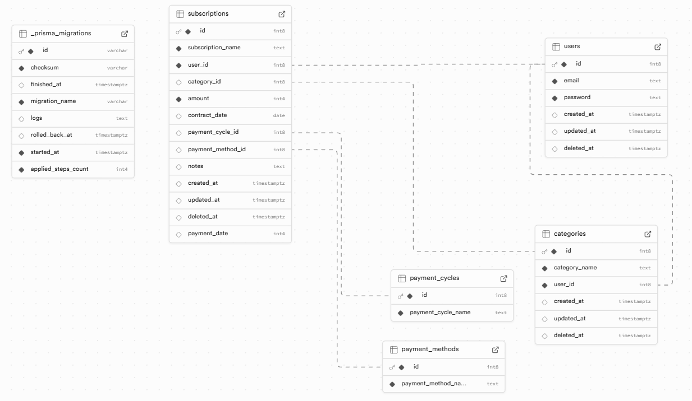

# サブスク管理アプリ

利用しているサブスクリプション（定期課金）を一覧・管理できるアプリです。  
今月の合計金額、月の平均金額を確認できます。

---

## 開発の目的

サブスクリプションでどのくらい月に支出しているか把握して、
無駄な支出を見直すことを目的としています。

---

## 主な機能

- ログイン／ログアウト
- サブスクの登録・更新・削除
- 今月の合計金額、月の平均金額の表示
- カテゴリーの登録・編集・削除
- 金額別、カテゴリー別の円グラブ表示
- レスポンシブデザイン対応

---

## アプリ仕様設計

### 簡易アプリ企画
https://docs.google.com/spreadsheets/d/1TyjVNvbB-PfmoR7mdDFU4A7NAsSBCazVpDECH_X58LM/edit?gid=1446009625#gid=1446009625

### 簡易アプリ仕様設計
https://docs.google.com/spreadsheets/d/1TyjVNvbB-PfmoR7mdDFU4A7NAsSBCazVpDECH_X58LM/edit?gid=577430712#gid=577430712


### デザイン
https://www.figma.com/design/y5oQntYWsn3e0Z3IbQB9CA/%E7%84%A1%E9%A1%8C?node-id=0-1&t=eARddOConz19GrSn-1


### ER図


---

## デモURL

[subscription-management-ashy.vercel.app](https://subscription-management-ashy.vercel.app/)

### デモアカウント

デモ用アカウントを使用して、アプリの全機能を確認できます。  
（登録・編集・削除も可能です）

- **メールアドレス：** demo@example.com  
- **パスワード：** password1234  

---

## 使用技術

| 分類 | 技術 |
|------|------|
| フレームワーク | Next.js (App Router) |
| フロントエンドライブラリ | React |
| 言語 | TypeScript |
| データベース | PostgreSQL（Supabase） |
| ORM | Prisma |
| スタイリング | Tailwind CSS, shadcn/ui |
| 認証 | NextAuth.js |
| 通知 | Sonner |
| アイコン | lucide-react |
| グラフ | Recharts |

---

## 使用技術の選定理由

### フロントエンドを採用した理由
- PC・スマホを問わず、どのデバイスからでも快適に利用できる環境を提供するため
- APIとのスムーズな連携により、ユーザーの操作に素早く反応する画面を作るため

### Reactを採用した理由
- コンポーネントの再利用性が高く、保守性に優れているため
- 豊富なライブラリ（フォーム、グラフ、UIコンポーネントなど）が活用できるため

### Next.jsを採用した理由
- フロントとバックエンドの処理を一元管理できるため
- App Routerを活用し、快適なユーザー体験を実現するため
- API Routesを利用してバックエンド処理を統合できるため

### Tailwind CSSを採用した理由
- カスタマイズ性と一貫性を両立できるため
- レスポンシブ対応を容易に実装できるため

### shadcn/uiを採用した理由
- Tailwind CSSとの相性が良く、デザインの統一ができるため
- よく使うUIパーツ（ダイアログ、トースト、セレクトなど）が標準実装されているため

### Rechartsを採用した理由
- Reactで扱いやすく、円グラフ描画ができるため

---

## 支払いサイクルのマスタについて

支払いサイクルのマスタは、<br>
一般的なサブスクリプションの支払い間隔を基にして、<br>
「30日ごと」、「1ヶ月ごと」～「12ヶ月ごと」の固定マスタとしています。

---

## 支払い方法のマスタについて

支払い方法のマスタは、<br>
一般的なサブスクリプションの支払い方法を基にして、<br>
「クレジットカード」、「キャリア決済」などの固定マスタとしています。

---

## 環境変数

以下の値を `.env.local` に設定してください。  
※ 実行環境（Vercel等）との接続互換性を確保するため、<br>
`DATABASE_URL` の末尾に `&sslmode=no-verify` の付与が必要な場合があります。

```bash
# Supabase設定
NEXT_PUBLIC_SUPABASE_URL=
NEXT_PUBLIC_SUPABASE_ANON_KEY=

# データベース接続設定 (Prisma)
DATABASE_URL=

# 認証設定 (NextAuth.js)
NEXTAUTH_SECRET=
NEXTAUTH_URL=http://localhost:3000
```

---

## セットアップ手順

1. リポジトリをクローン
```bash
git clone https://github.com/chi0119/subscription-management.git
cd subscription-management
```
2. 依存関係をインストール
```bash
npm install
```
3. Prisma Clientの生成
```bash
npx prisma generate
```
4. データベースの同期
```bash
npx prisma db push
```
5. 開発サーバーを起動
```bash
npm run dev
```
6. ブラウザで開く


---


